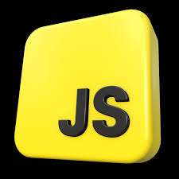
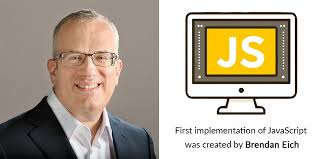
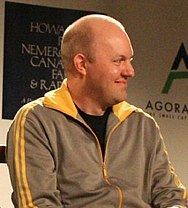

# JavaScript обычно используется как встраиваемый язык для программного доступа к объектам приложений. Наиболее широкое применение находит в браузерах как язык сценариев для придания интерактивности веб-страницам.
# Основные архитектурные черты: динамическая типизация, слабая типизация, автоматическое управление памятью, прототипное программирование, функции как объекты первого класса.
# На JavaScript оказали влияние многие языки, при разработке была цель сделать язык похожим на Java. Языком JavaScript не владеет какая-либо организация или компания, что отличает его от ряда языков программирования, используемых в веб-разработке.Название «JavaScript» является зарегистрированным товарным знаком корпорации Oracle в США.
!
<!--  -->
# Самая первая реализация JavaScript была создана Бренданом Эйхом (англ. Brendan Eich) в компании Netscape, и с тех пор обновляется, чтобы соответствовать ECMA-262 Edition 5 и более поздним версиям. Этот движок называется SpiderMonkey и реализован на языке C/C++. Движок Rhino создан Норрисом Бойдом (англ. Norris Boyd) и реализован на языке Java. Как и SpiderMonkey, Rhino соответствует ECMA-262 Edition 5.
 

# Перед Бренданом Эйхом, нанятым в компанию Netscape 4 апреля 1995 года[16], была поставлена задача внедрить язык программирования Scheme или что-то похожее в браузер Netscape. Поскольку требования были размыты, Эйха перевели в группу, ответственную за серверные продукты, где он проработал месяц, занимаясь улучшением протокола HTTP[16]. В мае разработчик был переброшен обратно, в команду, занимающуюся клиентской частью (браузером), где он немедленно начал разрабатывать концепцию нового языка программирования. Менеджмент разработки браузера, включая Тома Пакина (англ. Tom Paquin), Михаэля Тоя[англ.], Рика Шелла (англ. Rick Schell), был убеждён, что Netscape должен поддерживать язык программирования, встраиваемый в HTML-код страницы. Помимо Брендана Эйха, в разработке участвовали[16] сооснователь[18] Netscape Communications Марк Андрессен и сооснователь Sun Microsystems Билл Джой: чтобы успеть закончить работы над языком к релизу браузера, компании заключили соглашение о сотрудничестве в разработке[19]. Они ставили перед собой цель обеспечить «язык для склеивания» составляющих частей веб-ресурса: изображений, плагинов, Java-апплетов, который был бы удобен для веб-дизайнеров и программистов, не обладающих высокой квалификацией.
<!-- ,_2003-01_(cropped)-1.jpg) -->